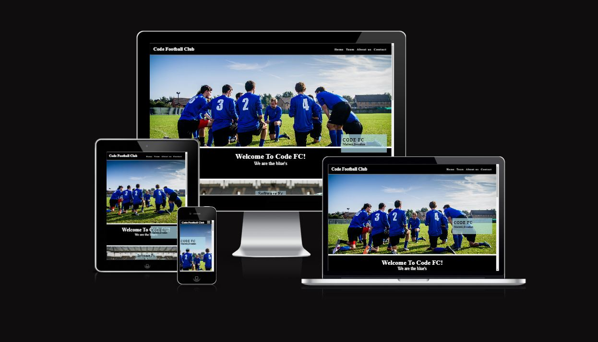
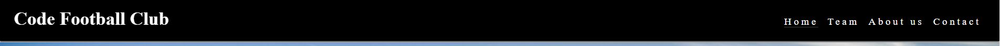
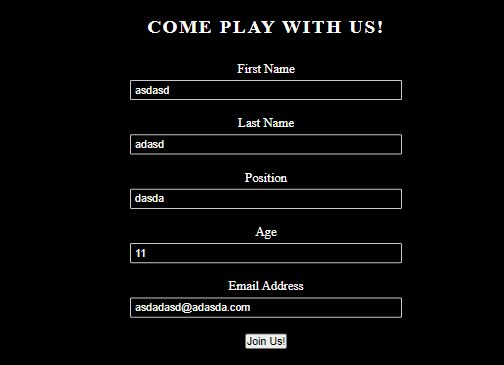
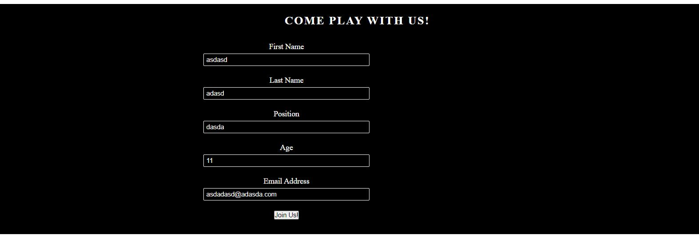
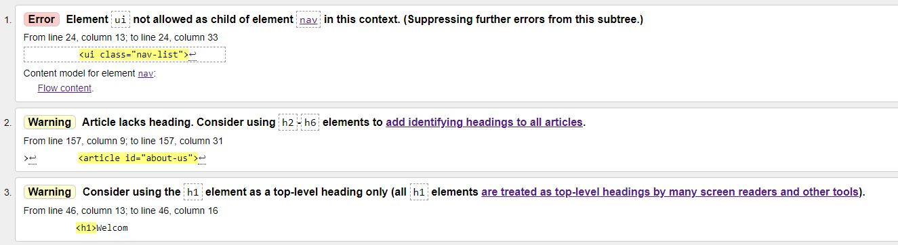

# Code Football Club

Code Football Club is a football club whom i built this website for. They are a newly started team and are looking to expand their football squad with players.

Users visiting this website will see the current squad members, the league standings and the opportunity to join the team by filling in a form.

## Features

* Navigation
   * Featured at the top of the page, the navigation bar shows the website name in the left corner(in white color): The log works as a link to the top of the page.
   * The home link takes you to the start of the page, team link takes you to the team section, about us takes you to the about us section and contact will take user to the form.
   * The navigation font are in white color to stand out from the black background.
   * The navigation lets the user now what site they are on and its easy to navigate.

* Home
   * When visiting this page user will see a hero picture of "the team" with a text with information of the team name and location.
   * User will be greated with a welcoming text and the teams motto, "We are the blue's"
   

* Team
   * By scrolling down or pressing team in navigationbar users will visit the team section. Here user will see the latest game played by the team. User will see the score and the teams that played.

   

   * Underneath user will see the team sheet. The team sheet is sorted by position, goal keepers, defenders, midfielders and strikers. User will also see the name of the players.

   

   * Also user visiting this page will see the league standings. Here user will see the name of the teams, games played, wins, draws, loses,goal difference and points collected.
    
    

* About us
   *  In this section users can read about the team, where they are based, which division they play in and the plans for the coming year. The team information is also stated.

    

* Contact
   *  The contact section contains a form that user can fill in if they are interested in playing with the team. The for ask users for their name, position age and email.

    

* Footer
   * There are four images that are links. They are in the same theme color, blue. 
   * These links will take you to Facebook, Youtubute, Instagram and Twitter.

## Testing

* I tested that this page works in diffrent browsers, Chrome, Firefox, Safari.
* I can confirm that this site is responsive, looks good and works on all standard screen sizes using the devtools device toolbar.
* I can confirm that all text on the site are readable and easy to understand.
* I have confirmed that the form works: requires entries in every field, will only accept an email in the email field, and the submit button works.
  
### Unfixed Bugs

* Its a bug that remain and its for bigger screens, the form does not get centered.
* I have media query for 768px, 992px, 1920px and 1440px and they all look good but with my screen it not centered.

### Validator Testing

* HTML
 * Some minor type error, easly fixed
* CSS
 * No errors were found.
* Accessibility

## Deployment

* The Site was deployed to GitHub pages. The steps to deploy are as follows:
 * In Github repository, navigate to the Settings tab
 * To the left find Code and automation, press pages
 * Look for Branch, select the Master branch and set folder to root.
 * Once that done, go to the main page of the project. Wait a few min the to the right under deployment you will find a link to you site.

The live link to this page - [Code Football Club](https://maadajibao.github.io/Project-1-Code-Football-Club/)

## Credits

### Content

* The code to make the social media links was taken from the CI Love Running Project.
* The code to make the navigation section was taken from the CI Love Running Project.

  
### Media

* The images for the hero and the latest score background was taken for [Pexels](https://www.pexels.com//)

   
